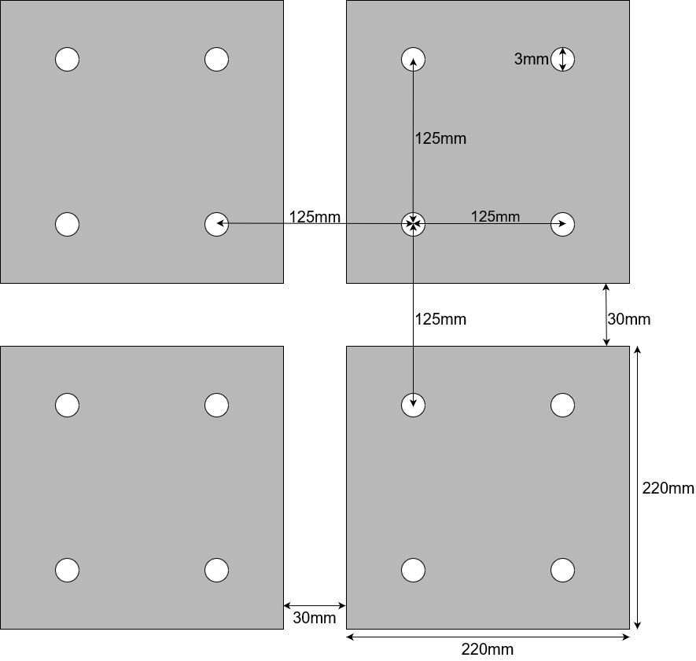
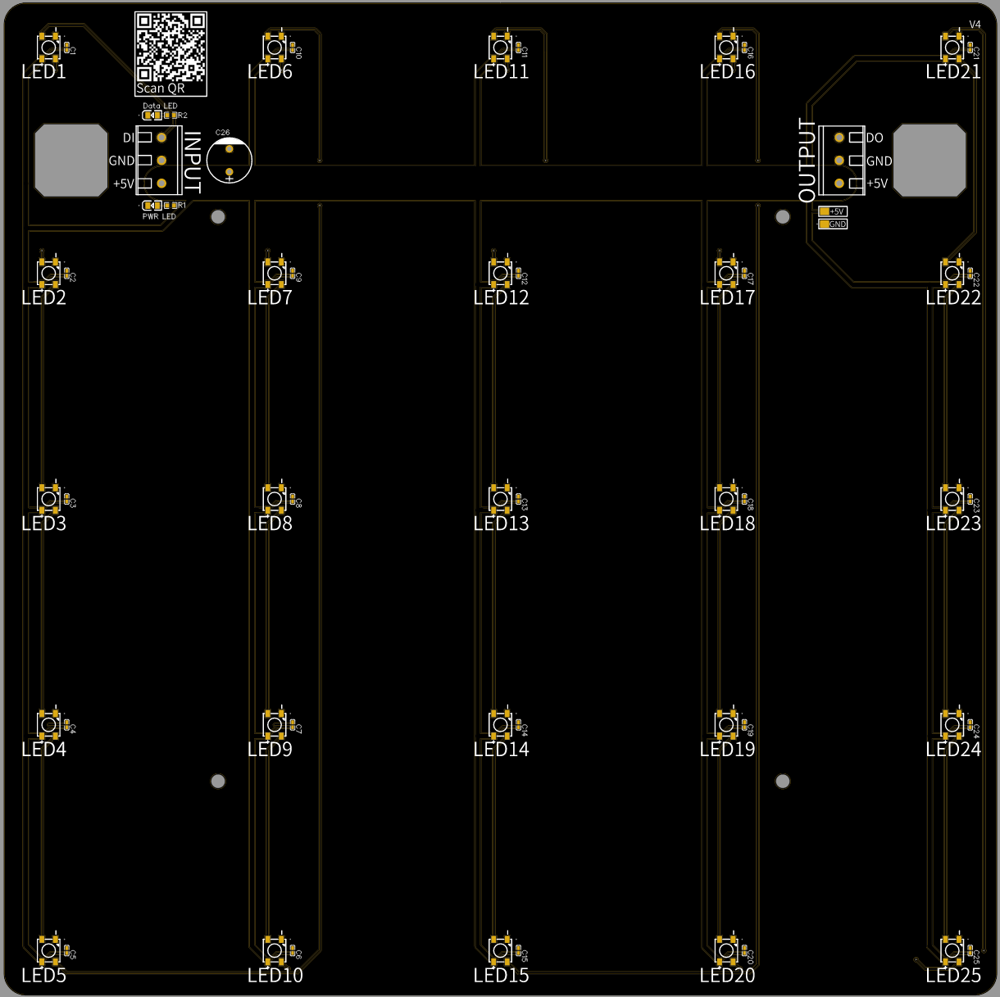
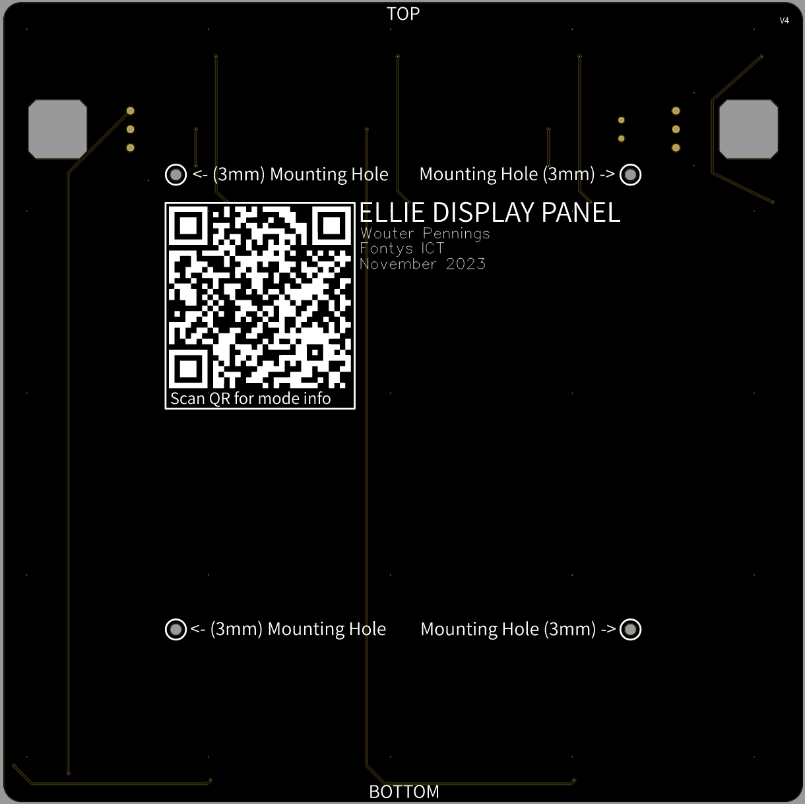

# ELLIE Panel PCB

> **DO NOT RELOCATED THIS PAGE TO A DIFFERENT URL, A QR CODE ON THE PCB POINTS TO THIS**

**View project online**: https://oshwlab.com/wouterpennings/ellie-pcb 

# Tech spec & info

- **Total current**: 60mA * 25 = 1500mA
- **Dimensions (WxH)**: 220mm x 220mm (30mm space between the PCB's)
- **Mounting hole grid size:**  12.5cm
- **Mounting hole size:** 3mm
- **LED type**: WS2812B ([datasheet](https://cdn-shop.adafruit.com/datasheets/WS2812B.pdf))
- **Decoupling capacitor**: 100nF
- Big 1000uF capacitor pin holes (Not placed be default, solder by hand if needed.)
- 1oz Copper layer
- 5v trace has 7.5mm width. Can handle max of 10A

# Dimensions

> NOTE: Dimensions image is not to scale

# Electrical Schematic

# PCB

Front of PCB                | Back of PCB
--------------------------- | -------------------------
 | 
