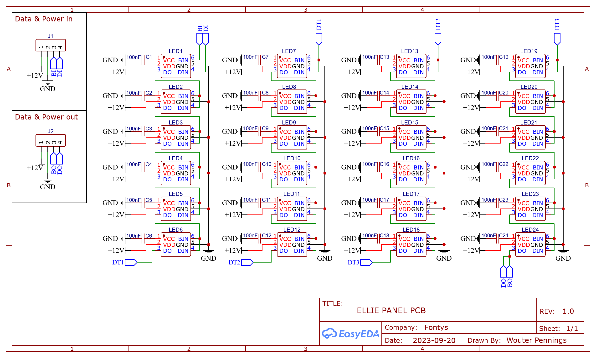

# ELLIE Panel PCB

> **DO NOT RELOCATED THIS PAGE TO A DIFFERENT URL, A QR CODE ON THE PCB POINTS TO THIS**

**View project online**: https://oshwlab.com/wouterpennings/ellie-pcb 

# Tech spec & info

- **Total current**: 15mA * 24 = ~360mA
- **Dimensions (WxH)**: 190mm x 290mm
- **LED type**: WS2815 ([datasheet](http://www.normandled.com/upload/201808/WS2815%20LED%20Datasheet.pdf))
- **Decoupling capacitor**: 100nF
- Big 1000uF capacitor pin holes (Not placed be default, solder by hand if needed.)
- 1oz Copper layer
- 12v trace has 5mm width. Can handle max of 7.5A

# Electrical Schematic

# PCB

Front of PCB                | Back of PCB
--------------------------- | -------------------------
 | 
