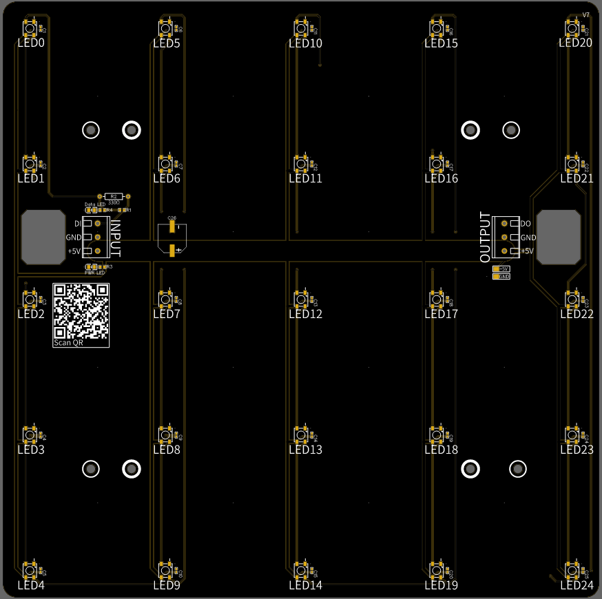
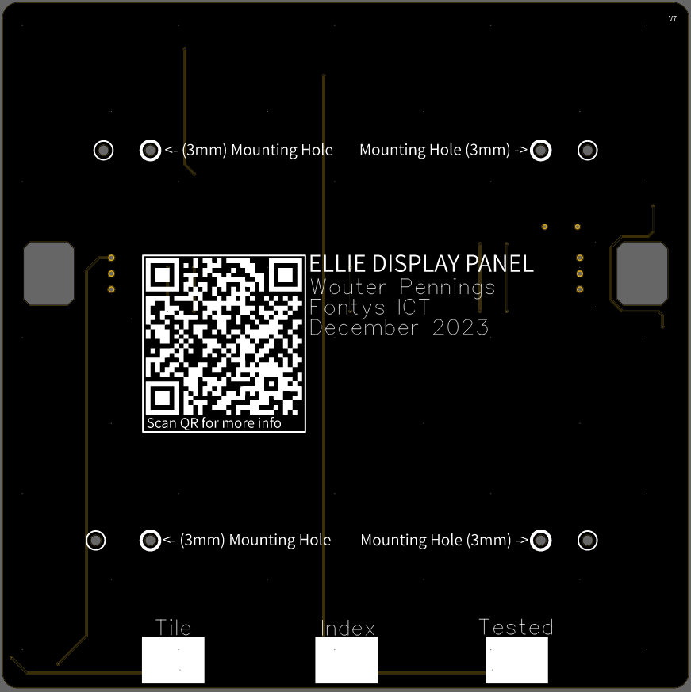
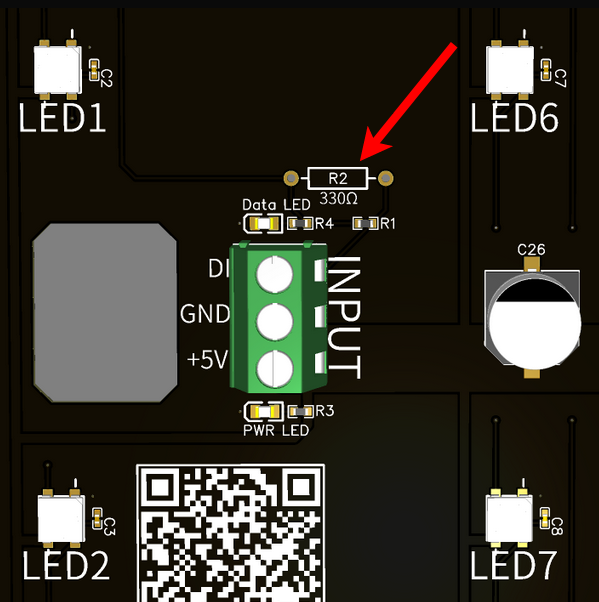
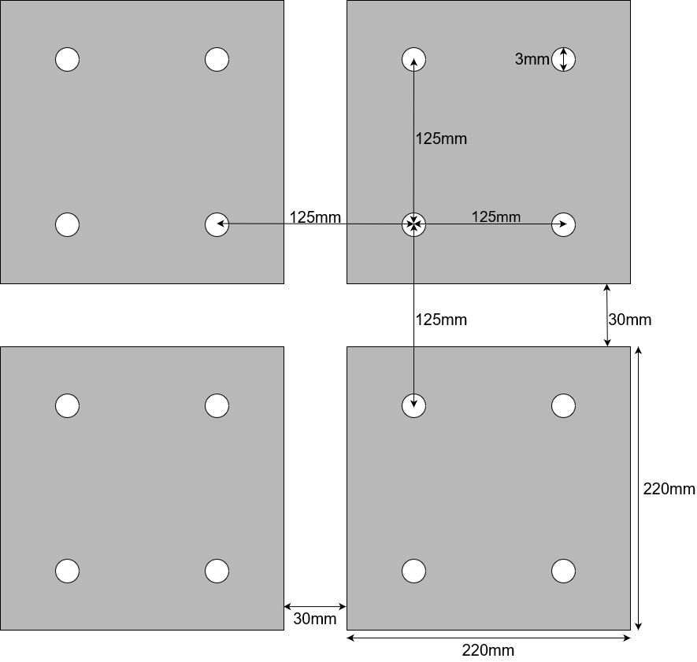
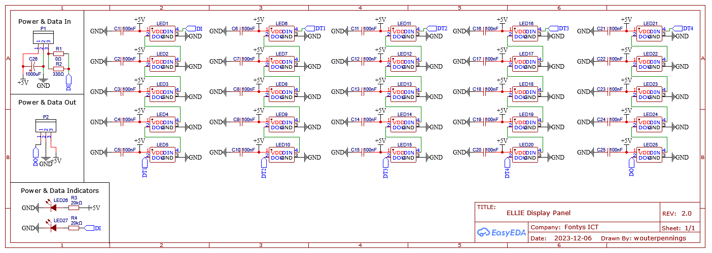

# ELLIE Display Panel 

The "Display Panel" PCB's are the panels with a 5x5 LED grid, spaced at 5cm. 

## PCB renders

Front of PCB                | Back of PCB
--------------------------- | -------------------------
 | 

## Ordering information

Got to [this image](img/order_settings.png) for information about what settings are recommended when ordering the display panels. 

It is also not recommeneded **NOT** to place the 330 ohm resistor ([BOM settings for reference](img/ordering_BOM.png)) on the `DI` trace. This resistor should only be placed at the beginning of the chain of WS2812B LED's. See image below for context:

## Specification & infomation

- **LED type:** WS2812B ([datasheet](https://cdn-shop.adafruit.com/datasheets/WS2812B.pdf))
  - **Total current:** 60mA * 25 = 1500mA. However, in reality, one full-white WS2812B LED only uses 36mA. Therefore one board uses about 900mA.
- **Dimensions (WxH):** 220mm x 220mm (30mm space between the PCB's)
- **Mounting hole grid size:** 125mm
- **Mounting hole size:** 3mm
- **Decoupling capacitor**: 100nF
- **Big Capacitor:** 1000uF capacitor pin holes (Not placed be default, solder by hand if needed.)
- **Coppper Thickness:** 1oz Copper layer
- **Trace Width:** 5v trace has 7.5mm width. Can handle max of 10A
- **Assembled PCB Weigth:** ~180 grams (Including all SMD components)

## Dimensions

There are four additional 3mm screw holes on the each PCB, one close to each "main" screw holes. "Main" screw holes have thicker rings printed around them, "extra" screw holes have thinner ones. The extra screw holes is if the holes no the wooden tiles do not align with the holes on the panels; you have additional.

These additional screw holes are not drawn on the dimension diagram below.

> NOTE: Dimensions image is not to scale

## Electrical Schematic

