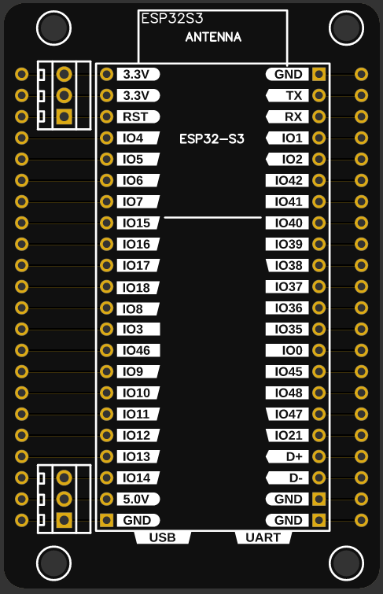
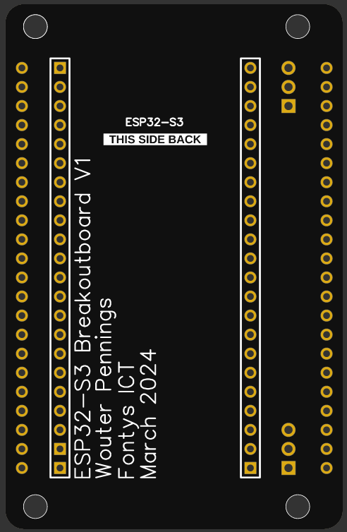
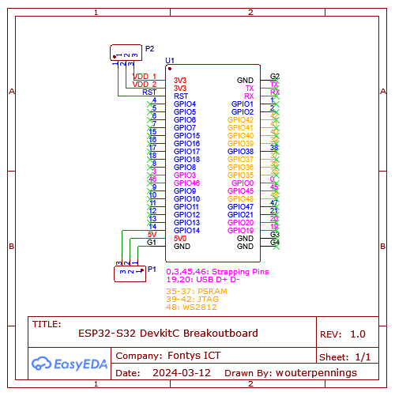

# ELLIE ESP32-S3 Breakoutboard

The "ESP32-S3 Breakoutboar" PCB's are ESP32-S3 breakoutboards. These boards to already exist but these custom ones have two main advantages over the "generic" ones:

1. These come with additional holes spaced at 1 mil or 2.56 mm, in these holes screw terminals can be soldered, aiding the ease of construction and maintainance of the Contour Wall.
2. Having a smaller footprint. The generic ones have a larger footprint, which would not fit in the electrical boxes.

## PCB renders

Front of PCB                | Back of PCB
--------------------------- | -------------------------
      | 

## Specification & infomation

- **Made for:** [ESP32-S3 DevKitC](https://docs.espressif.com/projects/esp-idf/en/stable/esp32s3/hw-reference/esp32s3/user-guide-devkitc-1.html)
- **Dimensions:** 45mm x 70mm
- **Mounting hole size:** 3mm
- **Coppper Thickness:** 1oz Copper layer

## Electrical Schematic

